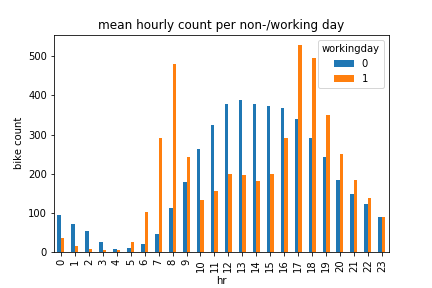
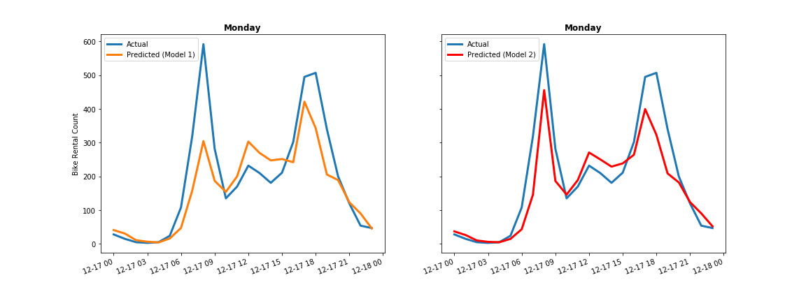
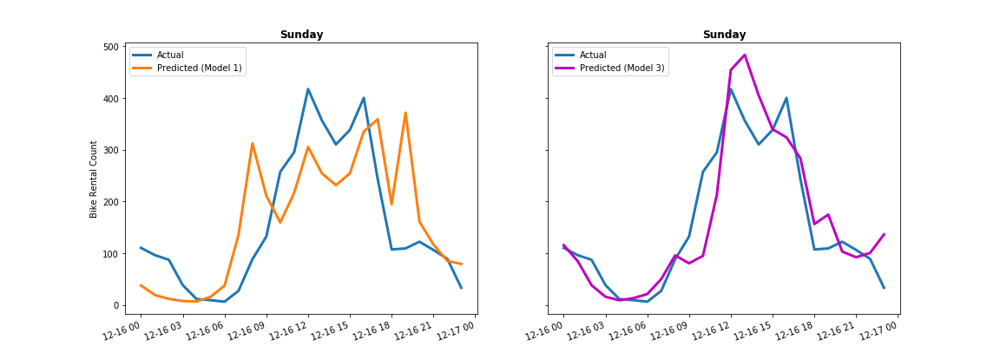

# Predicting bike demand using linear regression

Bike sharing demand
---------------------------
This project predicts bike sharing demand at any given hour. I build a simple machine learning model based on ordinary least squares regression to gain an understanding of the virtues and limitations of applying linear regression to a non-linear problem. In particular, I show:
  - how an understanding of non-linear interactions among features can be intuitive
  - how modelling such key interactions can greatly improve forecast skill.

Scroll down for some key takeaways.

Find more information on the Kaggle competition and the data provided [here](https://www.kaggle.com/c/bike-sharing-demand/overview).

View the project in the following order:
1. data_exploration.ipynb
    - follow the insights extracted through data exploration
2. ols_linear_regression.ipynb
    - follow the steps taken to build and improve the model
3. ols_linear_regression_assumptions.ipynb
    - verify linear regression assumptions

View the analyses directly by clicking the jupyter notebook files in the GitHub repository!
  - GitHub renders the files for immediate viewing
  - It might take a few seconds to render and/or you might have to hit `reload` if rendering is unsuccessful
  - The following installation steps are only necessary if the code is to be executed by the user

Installation
---------------------------

### Download the data

* Clone this repo to your computer
* Get into the folder using `cd Predicting-bike-demand-using-linear-regression`
* Switch into the `Data` directory using `cd Data`
* Download the data files from Kaggle  
    * You can find the data [here](https://www.kaggle.com/c/bike-sharing-demand/data)
* Extract all of the `.zip` files you downloaded
    * copy "train.csv" and "test.csv" files into the folder `Predicting-bike-demand-using-linear-regression/Data`
    * remove zip files from `Downloads`

### Install the requirements

* Install the requirements using `pip install -r requirements.txt`
    * Make sure you use Python 3
    * You may want to use a virtual environment for this

Usage
-----------------------
* Open any notebook using `jupyter-lab notebook.ipynb`
* Run notebook by selecting Kernel -> Restart Kernel and Run All Cells

Key takeaways
-----------------------

- Bike rental count is largely determined by time features such as hour, month and year
- __Figure 1__ shows the importance of the hour of day in particular in combination with the binary feature differentiating between working days and weekend days/holidays
- __Figure 2__ plots the predictions vs. actuals for a Monday using two different models
  - **Model 1** is a simple baseline model including time and weather features and no interaction terms
  - **Model 2** has one additional feature compared to Model 1: an interaction term between the binary features working day and 8th hour of the day
  - As can be seen by comparing both panels, the morning rush hour is better captured with Model 2
- __Figure 3__ plots the predictions vs. actuals for a Sunday using two different models
  - **Model 3** has several additional interaction terms involving radial-based functions to smoothen out the forecasts
  - As can be seen by comparing both panels, Model 3 captures the single broad Sunday peak much better than Model 1
- Having to explicitly model interaction terms in linear regression is a great way to understand which interactions play a key role in the underlying dynamics behind bike demand
- Using a different machine learning model which inherently captures non-linear behaviours can get us a better result faster, but possibly at the expense of an understanding of the underlying dynamics behind bike demand

## Figure 1:

## Figure 2:

## Figure 3:

